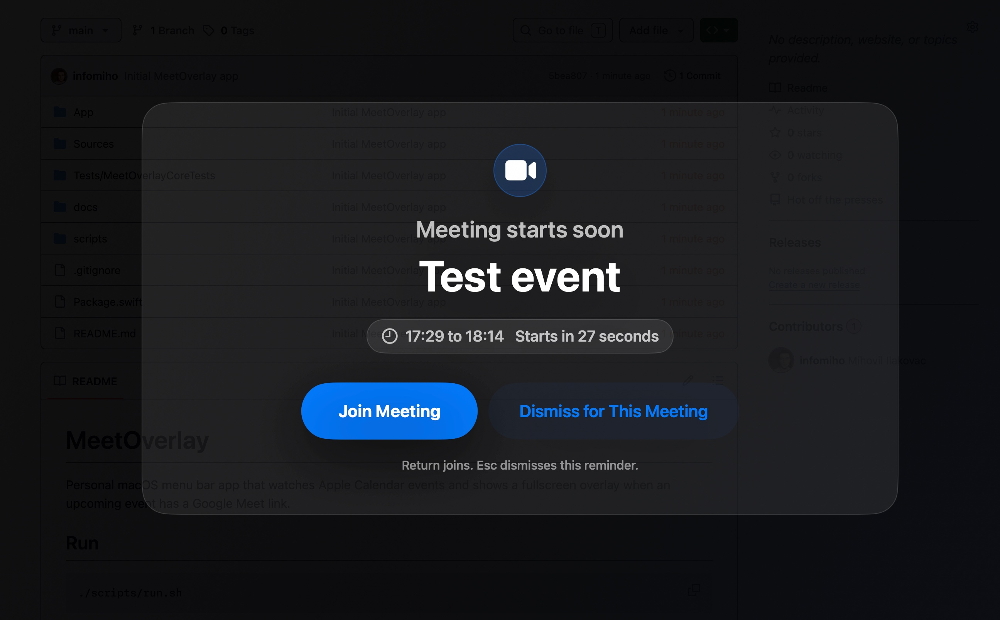

# MeetOverlay

Native macOS menu bar app that watches Calendar for Google Meet events, plays a sound, and shows a fullscreen overlay so you never miss the next call.



## Run

```sh
./scripts/run.sh
```

## Install

```sh
./scripts/install.sh
```

This builds, signs, copies, and opens `~/Applications/MeetOverlay.app`. To install into the system Applications folder instead, run:

```sh
INSTALL_DIR=/Applications ./scripts/install.sh
```

After installing, enable `Open at Login` in `Settings...` if you want the app to start automatically.

The app appears in the menu bar. It lists today's and tomorrow's events, marks events with Google Meet links, and shows today's next event as the menu bar title.

Use `Settings...` from the menu bar dropdown to choose visible calendars, toggle fullscreen reminders, and enable startup at login.

The fullscreen reminder plays `App/Resources/notification.mp3` when it appears.

Preferences are stored in macOS `UserDefaults`.

Press `Esc` or click `Dismiss` to close the fullscreen overlay.

Calendar permission is tied to the app's bundle identifier, path, and code-signing identity. The build script uses an available `Apple Development` signing identity when possible. If it falls back to ad-hoc signing, macOS may ask for Calendar access again after rebuilds.

## Requirements

macOS 14 or newer and Xcode command line tools. Google Calendar events must be synced into Apple Calendar.

No paid Apple Developer account is needed for local use.
